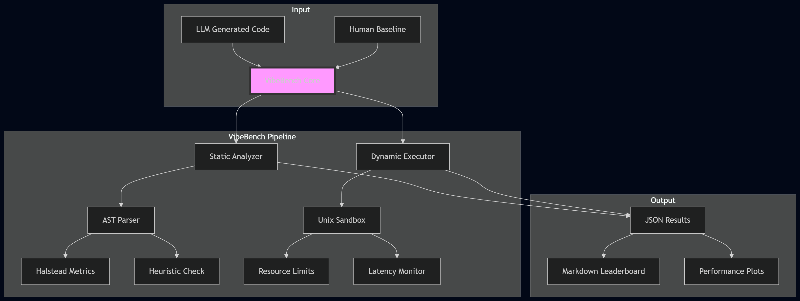
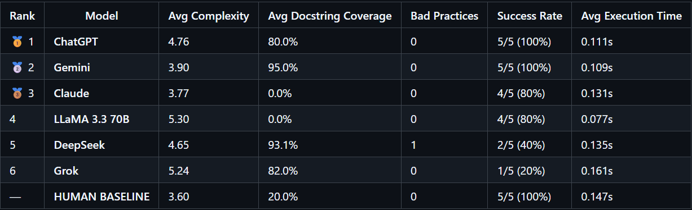

# Summary

The rapid integration of Large Language Models (LLMs) into the software
development lifecycle has created a critical need for evaluation frameworks
that extend beyond basic functional correctness. Traditional benchmarks,
such as HumanEval or MBPP, primarily measure a model's ability to pass unit
tests (functional correctness). However, they often overlook essential
software engineering attributes like code maintainability, structural
complexity, and operational resource efficiency.

VibeBench is an automated, extensible Python framework designed to fill this
gap. It provides a holistic evaluation of LLM-generated code by integrating
static quality heuristics with sandboxed dynamic execution. By walking the
Abstract Syntax Tree (AST), VibeBench quantifies Halstead complexity metrics
and identifies non-standard "bad practices"—such as ghost comments, hardcoded
credentials, and documentation gaps—that are frequently found in AI-synthesized
outputs but missed by traditional testers.

Simultaneously, the framework manages a secure lifecycle for generated scripts
using Unix-based resource limiting (CPU time and memory address space) to
measure runtime stability and latency. VibeBench is built for AI researchers,
software auditors, and developers who need to quantify the "technical debt"
introduced by autonomous agents. By grounding AI performance against a
formalized Human Baseline, it provides the necessary metrics to determine if
AI-generated code is truly production-ready.

VibeBench is designed for three primary user groups. 
AI researchers studying model evolution can use it to 
conduct longitudinal studies comparing how code quality 
changes across model versions. Software engineering teams 
evaluating AI coding assistants for production deployment 
can use it to audit technical debt before it accumulates. 
Benchmark designers can use it as a foundation for 
extending evaluation beyond functional correctness. The 
framework is released under the MIT License and designed 
to be extensible — new models, tasks, and heuristics can 
be added without modifying the core pipeline.

# Statement of need

Current evaluation methodologies for Large Language Model (LLM) generated code,
such as HumanEval [@chen2021codex] and MBPP [@austin2021program], primarily focus
on functional correctness through unit testing. While these benchmarks are
effective at determining if a model can solve a specific problem, they fail to
audit the structural integrity and production-readiness of the resulting code. In
a production environment, code that "works" but is overly complex, undocumented,
or resource-inefficient creates significant technical debt and security risks.

VibeBench addresses this gap by providing a toolset that treats AI-generated code
as software artifacts rather than just mathematical solutions. There is a
documented "documentation crisis" in LLM outputs, where models frequently omit
docstrings and internal comments required for maintainability. Furthermore,
existing benchmarks rarely account for the correlation between high structural
complexity and runtime instability.

VibeBench allows researchers and software auditors to:

- **Quantify Technical Debt:** Measure Halstead complexity and documentation
  coverage to predict long-term maintenance costs.
- **Audit Security and Best Practices:** Detect "AI-isms" like ghost comments or
  hardcoded credentials using AST-based heuristics.
- **Benchmark Operational Parity:** Compare AI performance against a formalized
  human baseline in a resource-constrained sandbox.

By providing these capabilities in an open-source, modular format, VibeBench
empowers researchers to conduct large-scale longitudinal studies on model
evolution, benchmark the energy efficiency of AI-generated algorithms for Green
IT research, and build "AI-Audit" pipelines that ensure autonomous agents adhere
to human-centric documentation and security standards. This enables the
scientific community to move toward a more holistic understanding of AI
performance that prioritizes long-term software sustainability over short-term
functional success.

# State of the field

Several benchmarks and frameworks currently exist for evaluating the code
generation capabilities of Large Language Models (LLMs). The most prominent
among these are HumanEval [@chen2021codex] and MBPP (Mostly Basic Python
Problems) [@austin2021program]. These benchmarks establish functional correctness
by measuring the pass@k metric—a statistical representation of whether a model
can produce at least one solution that passes a provided suite of unit tests.
Other tools, such as CodeSearchNet [@husain2019codesearchnet], provide
large-scale datasets for code retrieval and summarization but are not designed
for direct execution-based benchmarking.

Despite their widespread adoption, these tools share a common limitation: they
treat code as a mathematical solution rather than a software artifact. They
prioritize "binary success" (the code runs) over "structural health" (the code
is maintainable). For instance, HumanEval does not penalize models for producing
"spaghetti code" or failing to include docstrings, provided the output passes
the unit tests.

VibeBench was developed to bridge this gap between functional testing and
software engineering audits. While existing tools like Evaluating Large Language
Models Trained on Code focus on the logic of the algorithm, VibeBench provides
an automated pipeline for quantifying technical debt. To the authors' knowledge,
VibeBench is among the first frameworks to integrate AST-based heuristic
detection for "AI-isms" with Unix-controlled dynamic resource limiting to audit
the operational parity of LLM-synthesized software against a formalized human
baseline.Existing static analysis tools such as Pylint and Bandit 
focus on general Python code quality rather than on 
patterns specific to LLM-generated outputs, and do not 
integrate dynamic sandboxed execution or comparison against 
a human baseline.

# Software design

VibeBench is designed as a modular, extensible pipeline 
written in Python. The framework follows a 
"Collector-Analyzer-Executor" architecture to ensure that 
static heuristics and dynamic performance metrics are 
decoupled and independently verifiable. This separation is 
deliberate: static analysis operates on source code as 
text, requiring no execution environment, while dynamic 
execution requires a controlled subprocess environment with 
resource limits. By keeping these two analytical tracks 
independent, VibeBench allows researchers to run static 
analysis on any Python file regardless of whether it is 
safe to execute, and to add new heuristics to either track 
without affecting the other. The core logic is divided 
into three primary sub-packages, each with a single 
well-defined responsibility.

## Static Quality Analyzer (`core/analyzer.py`)

The `CodeAnalyzer` class serves as the static analysis engine, utilizing Python's
built-in `ast` module to parse generated code into a tree structure without
execution.

- **Heuristic Engine:** Implements custom AST visitors to detect "AI-isms" —
  patterns common in LLM outputs such as ghost comments (empty `#` symbols) and
  hardcoded credentials.
- **Complexity Metrics:** Integrates the `radon` and `halstead` libraries to
  compute Cyclomatic Complexity and Halstead Volume, providing a mathematical
  basis for maintainability assessment.

## Sandboxed Dynamic Executor (`core/executor.py`)

The `CodeExecutor` implements a secure lifecycle management system for safely
evaluating unverified AI-generated code.

- **Resource Limiting:** Leverages the Unix `resource` module to enforce hard
  limits on CPU time (`RLIMIT_CPU`) and maximum memory address space (`RLIMIT_AS`),
  preventing infinite loops or memory exhaustion from destabilizing the host system.
- **Isolation:** Each test run executes in a clean environment, capturing `stdout`,
  `stderr`, and exit codes to determine runtime stability.

## Reporting and Visualization (`core/reporter.py`)

The reporting layer aggregates JSON-formatted raw data into human-readable outputs.

- **Leaderboard Generation:** Automatically calculates averages across multiple
  trials and generates Markdown tables for direct inclusion in documentation.
- **Performance Plotting:** Utilizes `matplotlib` to visualize the correlation
  between structural complexity scores and execution success rates.

# Research impact statement

VibeBench enables a category of empirical software engineering research 
that existing benchmarks cannot support: the systematic audit of 
LLM-generated code as a software artifact rather than a mathematical 
solution. By integrating static quality heuristics with sandboxed dynamic 
execution, VibeBench allows researchers to answer questions that 
pass/fail unit testing cannot address.

In our initial evaluation across six models and five tasks, VibeBench 
revealed several findings with direct implications for AI-assisted 
software development. First, all evaluated models exhibited a significant 
documentation gap: Claude produced 0% docstring coverage across all tasks 
despite an 80% functional success rate, demonstrating that functional 
correctness and code maintainability are independent dimensions that must 
be measured separately. Second, human-authored baseline solutions achieved 
lower average cyclomatic complexity (3.60) than every evaluated AI model, 
confirming a systematic over-engineering tendency in LLM outputs that has 
practical consequences for long-term code maintenance costs. Third, 
VibeBench's heuristic detection identified a mutable default argument 
anti-pattern in DeepSeek's TASK-005 output — a runtime-risk pattern that 
caused an actual execution failure and that no existing benchmark would 
surface.

These findings demonstrate that VibeBench fills a genuine measurement gap 
in the LLM evaluation landscape. Researchers studying model evolution, 
comparing code generation approaches, or building AI-audit pipelines for 
production deployment can use VibeBench to quantify dimensions of code 
quality that are invisible to correctness-only benchmarks. The framework 
is designed to be extensible, allowing the research community to add new 
heuristics, models, and task categories as the field evolves.

# Mathematics

VibeBench quantifies software quality through two complementary metric families:
static complexity measures derived from source structure, and dynamic operational
metrics derived from sandboxed execution.

## Static Complexity

Halstead Volume ($V$) measures the information content of a program based on
operator and operand counts [@halstead1977elements]:

$$V = (N_1 + N_2) \cdot \log_2(n_1 + n_2)$$

where $N_1$ and $N_2$ are the total counts of operators and operands respectively,
and $n_1$ and $n_2$ are the counts of unique operators and operands. Higher volume
indicates greater cognitive load required to understand the code.

Cyclomatic Complexity ($M$) quantifies the number of linearly independent paths
through a program's control flow graph [@mccabe1976complexity]:

\begin{equation}\label{eq:cyclomatic}
M = E - N + 2P
\end{equation}

where $E$ is the number of edges, $N$ is the number of nodes in the control flow
graph, and $P$ is the number of connected components. VibeBench flags code with
$M > 10$ as high-risk for maintainability failure, consistent with McCabe's
original threshold.

## Dynamic Operational Metrics

Operational Parity ($\Phi$) measures how closely an LLM-generated solution
matches the runtime efficiency of a human-authored baseline:

\begin{equation}\label{eq:parity}
\Phi = \frac{T_{\text{base}}}{T_{\text{llm}}}
\end{equation}

where $T_{\text{base}}$ is the execution latency of the human baseline and
$T_{\text{llm}}$ is the execution latency of the LLM-generated code under
identical resource constraints. A value of $\Phi \approx 1$ indicates optimal
parity; $\Phi \gg 1$ indicates the LLM solution is significantly slower than
the human baseline.

The composite **VibeBench Score** ($\Sigma$) aggregates static and dynamic
performance into a single normalized metric:

$$\Sigma = w_1 \cdot \hat{V} + w_2 \cdot \hat{M} + w_3 \cdot \Phi$$

where $\hat{V}$ and $\hat{M}$ are min-max normalized Halstead Volume and
Cyclomatic Complexity respectively, and $w_1, w_2, w_3$ are configurable
weights summing to 1. Default weights are set empirically at
$w_1 = 0.4$, $w_2 = 0.4$, $w_3 = 0.2$.

# Figures

As shown in \autoref{fig:architecture}, the framework ensures that static heuristics
(Halstead complexity, docstring coverage) are captured independently of dynamic
performance metrics.

{ width=80% }

# AI usage disclosure

In accordance with JOSS policies, the author discloses that generative AI tools
(specifically Google Gemini and ChatGPT) were utilized during the development of
this project.

- **Software Development**: AI was used to assist in writing standard boilerplate
  code for the reporting engine and for debugging Abstract Syntax Tree (AST)
  visitor patterns. The core logic of the VibeBench evaluation framework,
  including the specific static quality heuristics and the dynamic
  resource-limiting implementation, was designed and verified by the author.
- **Manuscript Preparation**: AI tools were used for language refinement,
  grammatical correction, and optimizing the LaTeX formatting of the manuscript.

All scientific claims, experimental results, and data interpretations presented
in this paper are the original work of the author and have been manually verified
for accuracy.

# Acknowledgements 

The author thanks the faculty and administration of Saint Joseph Higher Secondary
School, Dhaka, for fostering an environment that supports independent student
research. The author also thanks Mushrat Salehin Nibir for his valuable feedback
on the codebase, suggestions for improvement, and for identifying and reporting
issues during development. Special thanks are also extended to the Executive
Committee and members of the Josephite Scintilla Science Club (JSSC) for their
practical feedback on the framework's utility and their continued encouragement
of student-led work in software engineering and AI research.

# References
